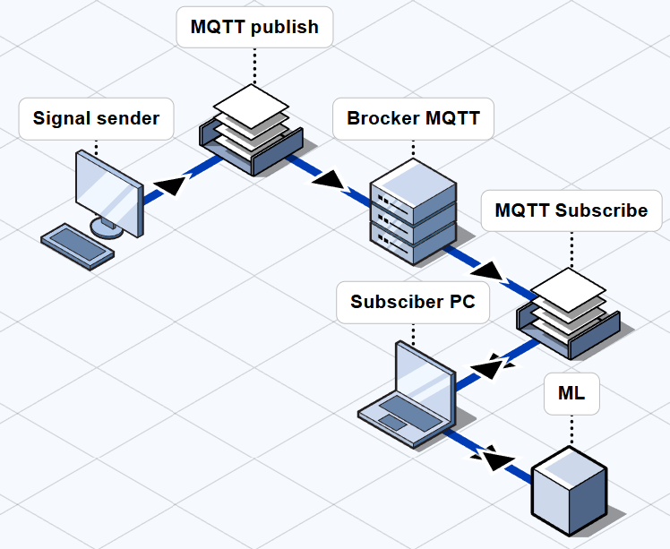

# Times series recognition
## Description

Ces programmes viennent d'un projet de Master dans le but de reconaître des series de données times series. Un programme mosquito.py envoie les données en temps réel pour simuler l'envoie des données par un capteur et l'autre programme sub.py, s'abonne au brocker, calcule les "features" sur une fenêtre glissante du signal et applique le modèle de machine learning permettant de reconnaître le signal.

## Architecture 

